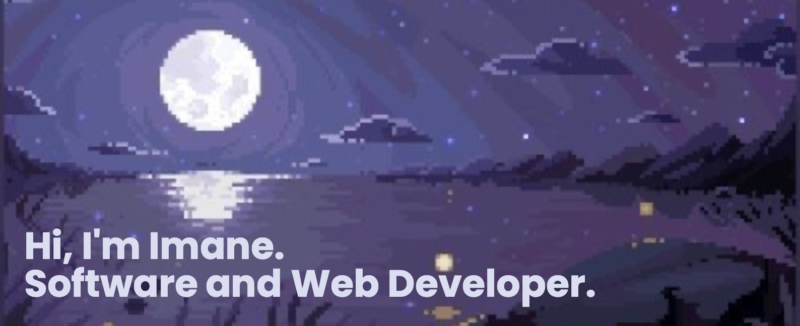

    

        <pre>
            💼 BSc in Software Engineering @ uOttawa  
            💻 Currently learning: C++, Java, JavaScript, React
            📖 Working on: Online Album Store • FemHealth Website
            🎮 Interests: Music • Games • K-Dramas • Coding • Karaoke • Boba  
            👾 Pronouns: She/Her
        </pre>

    <h3>🛠️ Tech Stack</h3>
    

      
      
      
      
      
      
      
      
    

   <picture>
      <source
        srcset="https://github-readme-stats.vercel.app/api?username=imanemm&show_icons=true&theme=tokyonight"
        media="(prefers-color-scheme: dark)"
      />
      <source
        srcset="https://github-readme-stats.vercel.app/api?username=imanemm&show_icons=true"
        media="(prefers-color-scheme: light), (prefers-color-scheme: no-preference)"
      />
      
    </picture> 

    

