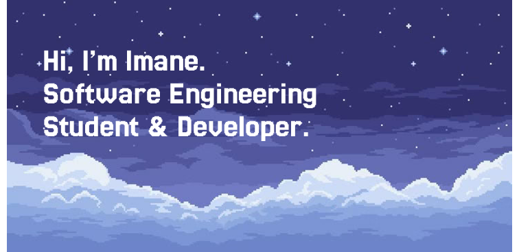

<p align="center">
  
</p>

# 👾 Hi, I'm Imane

💻 Software Engineering Student @ University of Ottawa  
🎨 I enjoy building creative projects that combine **technology, design, and music**

---

## 🌱 Currently
```
💼 BSc Software Engineering @ uOttawa
💻 Learning: Next.js • Full-Stack Development
📖 Building: MuseJournal • Pomodoro Timer
🎮 Interests: Game Dev • Music • Pixel Art • K-Dramas • Karaoke • Boba
🌍 Languages: English • French • Italian (learning) • Korean (learning)
👾 Pronouns: She / Her
```
---

## 🛠 Tech Stack

**Languages:** Java • Python • HTML • CSS • JavaScript • SQL • PowerShell

**Frameworks:** React • Tailwind CSS • Next.js • SpringBoot

**Tools:** Git • Github • VSCode • Figma • Vercel • Prisma • Postman

---

⭐ Built with curiosity, creativity, and lots of late-night coding.
